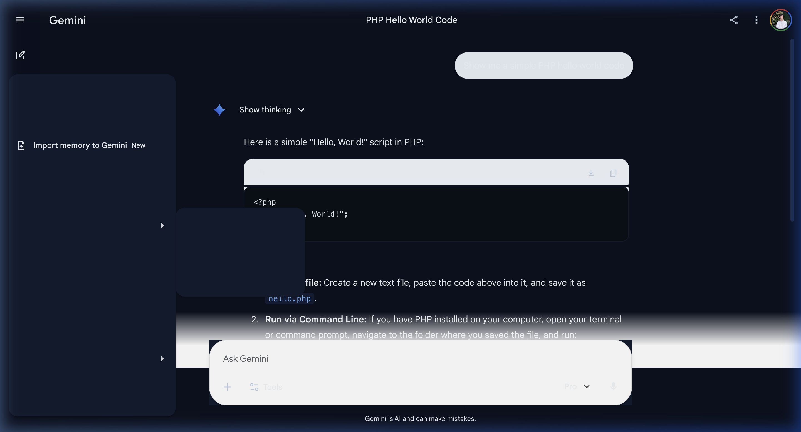
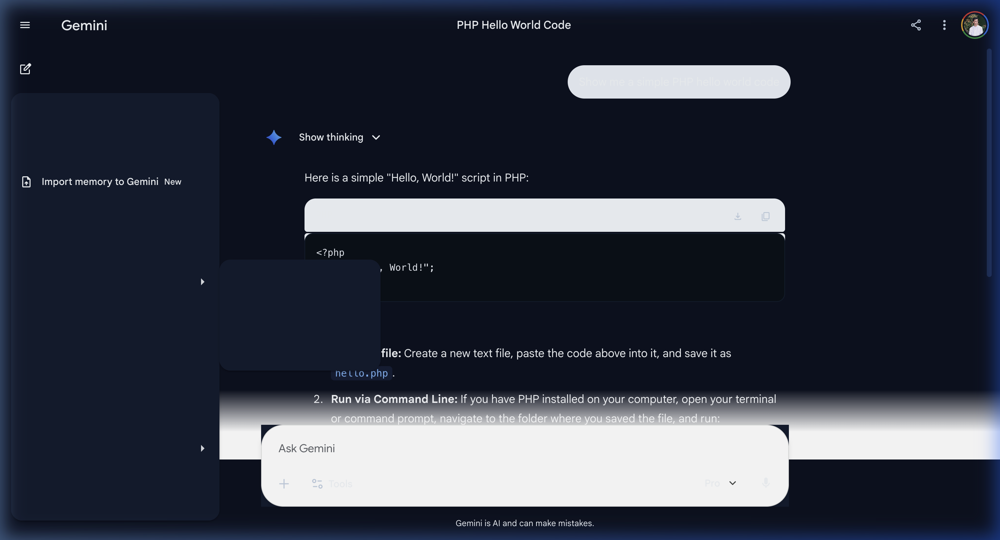
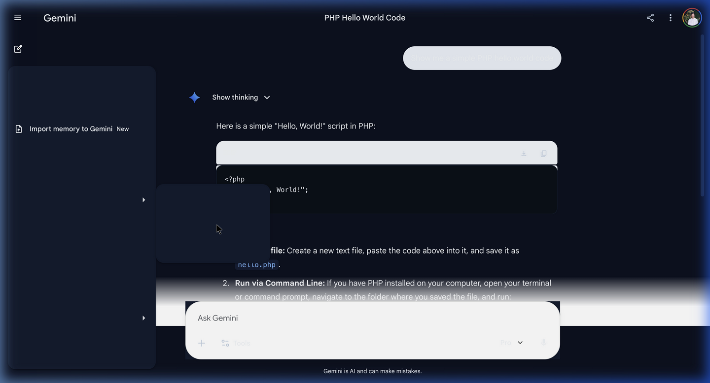

# ✨ Gemini UI Enhancer

  
  
<b>A premium, lightweight extension to supercharge your Google Gemini experience.</b>

  
  
  

---

## 🌟 Overview

**Gemini UI Enhancer** transforms the default Google Gemini interface into a highly polished, developer-friendly workspace. It removes annoying layout bugs (like the "Ask Gemini" box blocking your code), introduces beautiful developer-centric themes, and gives you granular control over your chat environment.

  <!-- Place your main screenshot here, replace the placeholder link -->
  

---

## 🚀 Features

🎨 **Premium Themes:**
- **Midnight:** Deep, high-contrast dark mode with electric blue accents.
- **Dracula:** Inspired by the famous Dracula theme for developers.
- **Nord:** Arctic, calm, and elegant dark mode.
*(All themes use zero layout-breaking overrides—just pure, beautiful color mapping).*

📏 **Layout Fixes:**
- **Code Block Unblocking:** Fixes the native bug where the input box hides the bottom of long code responses.
- **Wide Mode Toggle:** Expand the chat interface to take up 95% of your screen width—perfect for reading massive code snippets or tables.
- **Sidebar Lock:** Pin the sidebar so it stops auto-collapsing.

🔤 **Typography & Polish:**
- Uses **Inter** for beautiful, legible UI text.
- Uses **JetBrains Mono** for all code blocks.
- Real-time **Font Size Scaling** slider to make text as large or small as you need without breaking the UI.
- Thinner, cleaner scrollbars and smooth fade-in animations.

---

## 🛠️ Installation (Free / Developer Mode)

Since this extension is open-source and currently hosted on GitHub, you can install it on any Chromium browser (Chrome, Brave, Edge) 100% for free using Developer Mode.

1. **Download the Code**
   - Click the green `<> Code` button at the top of this repository and select **Download ZIP**.
   - Extract the downloaded ZIP file to a folder on your computer.

2. **Open Extension Settings**
   - In your browser, type `chrome://extensions/` (or `brave://extensions/` / `edge://extensions/`) into the address bar and press Enter.

3. **Enable Developer Mode**
   - Turn on the **"Developer mode"** toggle switch in the top right corner.

4. **Load the Extension**
   - Click the **"Load unpacked"** button in the top left.
   - Select the extracted `gemini-ui-enhancer` folder.

🎉 **You're done!** Pin the extension to your toolbar, open [Google Gemini](https://gemini.google.com/), and click the extension icon to start customizing!

---

## 📸 Screenshots

| Dracula Theme in Action | Extension Settings |
| :---: | :---: |
|  |  |

| Dracula Theme Selected | Midnight Theme Selected |
| :---: | :---: |
|  |  |

---

## 💻 Tech Stack
- Vanilla JavaScript (Manifest V3)
- HTML5 / Vanilla CSS
- Zero external dependencies. Fast, lightweight, and completely private.

---

## 📜 Privacy & Security
This extension is **100% private**. It does not collect, store, or transmit any user data. All settings are synced locally via Chrome's native storage API. No external scripts are injected.

---

## 🤝 Contributing
Contributions, issues, and feature requests are welcome! 
Feel free to check [issues page](https://github.com/gmsabbirahmed1/gemini-ui-enhancer/issues).

---

## 📧 Contact
For any inquiries or feedback, feel free to reach out:
**Email:** gmsabbirahmed1@gmail.com

---

  Made with ❤️ by <a href="https://github.com/gmsabbirahmed1">Sabbir Ahmed</a>

